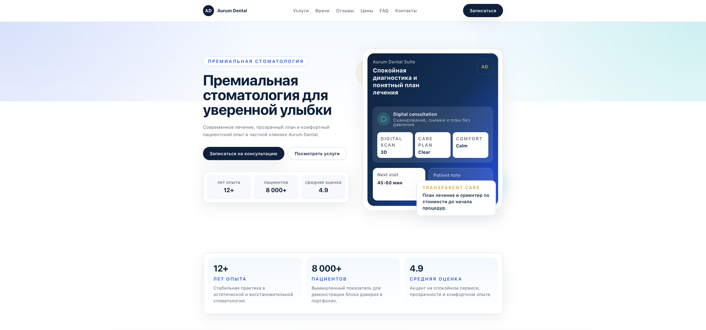
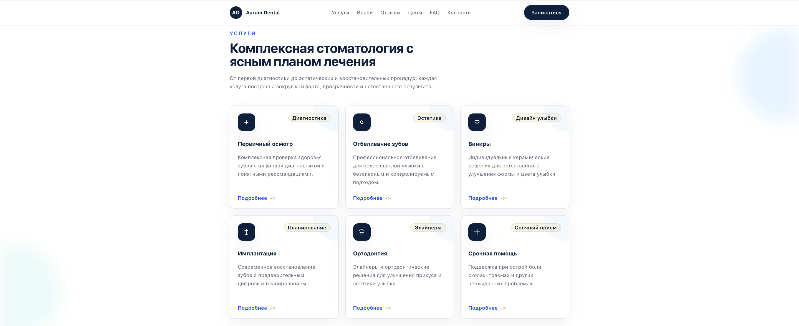
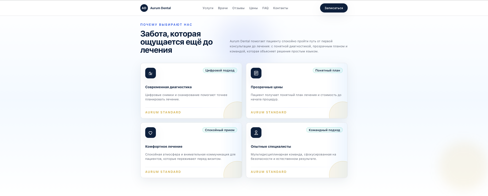
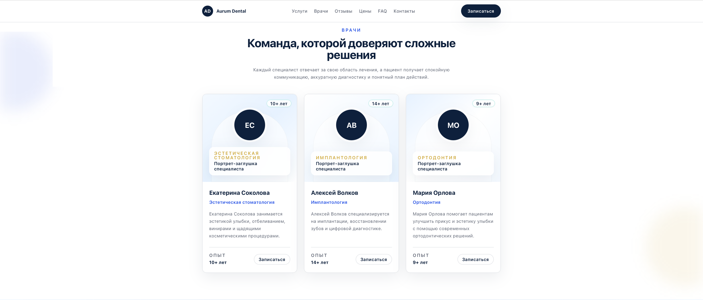
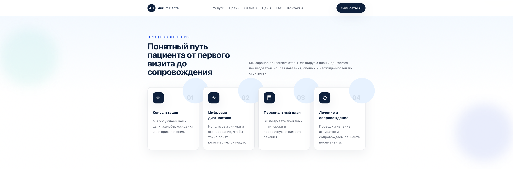
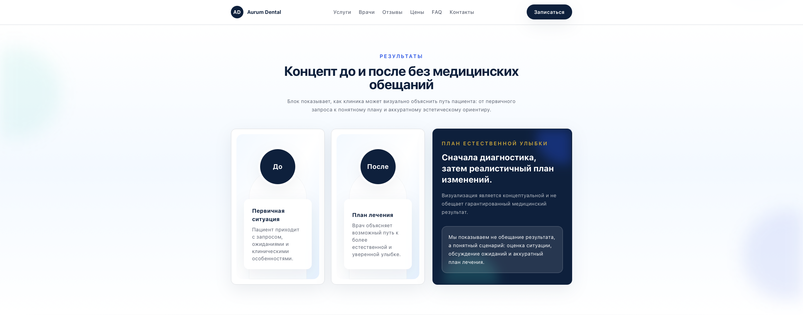
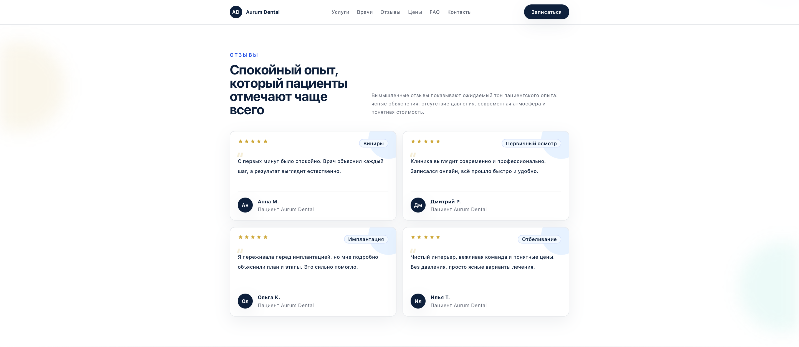
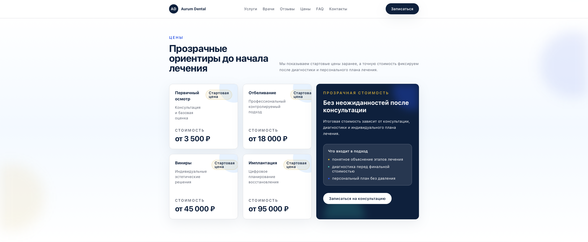
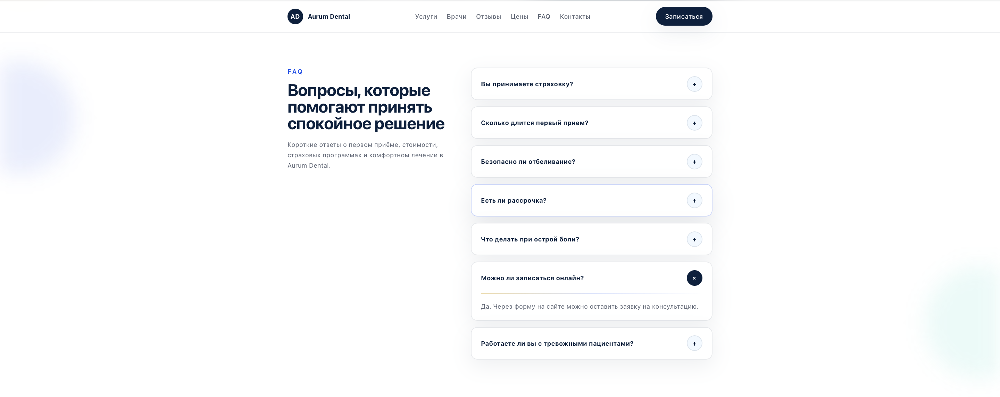
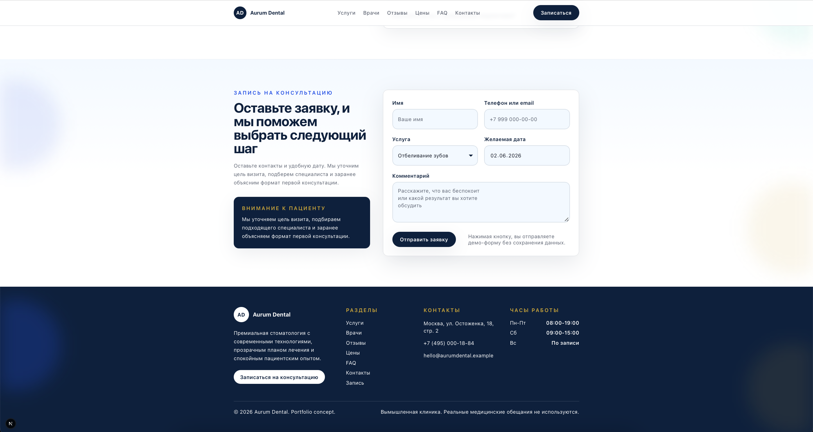

# Aurum Dental Landing

Премиальный одностраничный сайт для частной стоматологической клиники. Проект показывает, как можно упаковать медицинскую услугу в современный, доверительный и коммерчески понятный лендинг.



## О проекте

Aurum Dental Landing - портфолио-проект для премиальной стоматологии с фокусом на доверие, прозрачность и запись на консультацию. Лендинг ведет пользователя от первого впечатления к выбору услуги, знакомству с врачами, пониманию процесса лечения, просмотру цен и отправке заявки.

Проект подходит для демонстрации навыков в создании лендингов для клиник, салонов, локальных premium-сервисов и экспертных бизнесов.

Ключевая задача страницы - превратить посетителя в заявку на консультацию через понятную структуру, аккуратную визуальную систему и сильные CTA.

## Возможности

- Hero-секция с основным оффером, CTA и премиальной визуальной композицией.
- Блоки доверия со статистикой, преимуществами и отзывами.
- Сетка услуг с описаниями, иконками и ссылками на запись.
- Карточки врачей с российскими именами, специализацией и опытом.
- Пошаговый процесс лечения от консультации до сопровождения.
- Концепт результатов до/после без медицинских обещаний.
- Прозрачный pricing в рублях с пояснением финальной стоимости.
- FAQ accordion для закрытия базовых возражений.
- Форма записи с валидацией, выбором услуги, даты и сообщением об успешной отправке.
- Адаптивная mobile-first верстка для desktop, tablet и mobile.

## Технологии

- Next.js 16
- React 19
- TypeScript
- Tailwind CSS
- ESLint
- Component-based architecture
- Static content data layer

## Скриншоты

<table>
  <tr>
    <td width="50%">
      
      <br />
      <strong>Services</strong>
      <br />
      Карточки услуг с премиальной визуальной подачей.
    </td>
    <td width="50%">
      
      <br />
      <strong>Why Choose Us</strong>
      <br />
      Преимущества клиники и блоки доверия.
    </td>
  </tr>
  <tr>
    <td width="50%">
      
      <br />
      <strong>Doctors</strong>
      <br />
      Карточки специалистов для premium-сегмента.
    </td>
    <td width="50%">
      
      <br />
      <strong>Treatment Process</strong>
      <br />
      Понятный путь пациента от первого визита до сопровождения.
    </td>
  </tr>
  <tr>
    <td width="50%">
      
      <br />
      <strong>Results</strong>
      <br />
      Аккуратный концепт до/после без завышенных обещаний.
    </td>
    <td width="50%">
      
      <br />
      <strong>Testimonials</strong>
      <br />
      Отзывы пациентов с рейтингом и указанием услуги.
    </td>
  </tr>
  <tr>
    <td width="50%">
      
      <br />
      <strong>Pricing</strong>
      <br />
      Прозрачные цены в рублях и пояснение по диагностике.
    </td>
    <td width="50%">
      
      <br />
      <strong>FAQ</strong>
      <br />
      Accordion с ответами на частые вопросы перед записью.
    </td>
  </tr>
  <tr>
    <td colspan="2">
      
      <br />
      <strong>Appointment Form & Footer</strong>
      <br />
      Финальный CTA, форма записи, контакты, часы работы и навигация.
    </td>
  </tr>
</table>

## Структура проекта

```text
aurum-dental-landing/
├── screenshots/
├── src/
│   ├── app/
│   │   ├── globals.css
│   │   ├── layout.tsx
│   │   └── page.tsx
│   ├── components/
│   │   ├── layout/
│   │   ├── ui/
│   │   ├── AppointmentForm.tsx
│   │   ├── Doctors.tsx
│   │   ├── FAQ.tsx
│   │   ├── Hero.tsx
│   │   ├── Pricing.tsx
│   │   ├── Results.tsx
│   │   ├── Services.tsx
│   │   ├── Testimonials.tsx
│   │   ├── TreatmentProcess.tsx
│   │   ├── TrustStats.tsx
│   │   └── WhyChooseUs.tsx
│   └── data/
│       └── site.ts
├── package.json
├── tailwind.config.ts
└── README.md
```

## Локальный запуск

Установить зависимости:

```bash
pnpm install
```

Запустить проект в режиме разработки:

```bash
pnpm dev
```

Собрать production-версию:

```bash
pnpm build
```

Проверить код:

```bash
pnpm lint
pnpm typecheck
```

## Будущие улучшения

- Подключить отправку заявок через API или form service.
- Добавить email-уведомления для администратора клиники.
- Добавить карту и расширенный блок локации.
- Подготовить реальные оптимизированные фотографии врачей и клиники.
- Добавить CMS для редактирования услуг, цен и FAQ.
- Добавить аналитику событий для CTA и формы записи.
